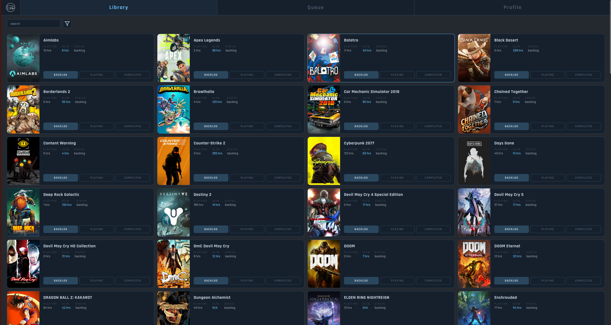
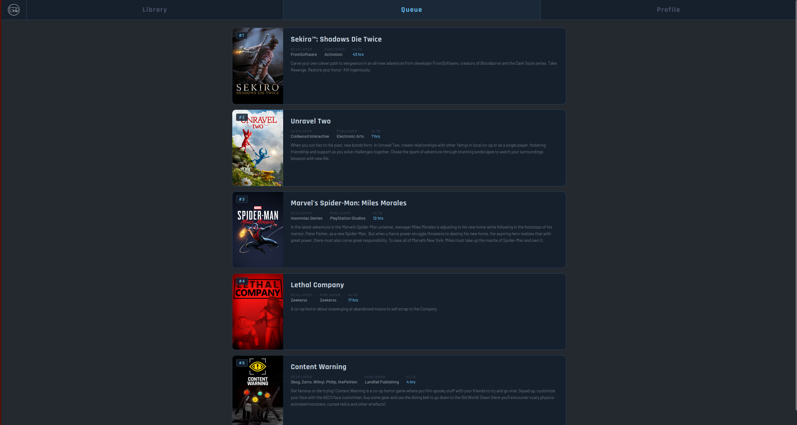

# GameQueue
> **Actually clear your backlog**

GameQueue is a full-stack backlog management app for your Steam backlogs. It analyzes your library and recommends what to play next using a simple cosine similarity algorithm using vectors built on your play history, genre preferences and playtime.

---

## Features

- [ ] **Smarter Personalized Recommendations** -- Cosine similarity algorithms builds game preference vector based on preferences provided by you and scores your backlog based on that to recommend games. 
- [ ] **Direct Steam Library Import** --  Import your steam library by just your Steam ID using Steam Web API. GameQueue automatically pulls your library, playtime and genre data.
- [ ] **HowLongToBeat Integration** -- Check against a kaggle HLTB data base for completion estimate.
- [ ] **Filtering** -- Filter your library based on status, genre, and HLTB time range.
- [ ] **Tracking Status** -- Mark games as backlog, playing or completed and let that influence your future recommendations.
---

## Showcase

### Library


### Queue/Recommendation


---
## How it works

### Recommendation Algorithm
1. **Build user vector** -- Count how many times the user has played a genre across completed and playing games. Use user's preferences if none.
2. **Game vector** -- Create a lists of zeroes of the same length as the genre index and mark each genre that corresponds to the game's genre as 1.
3. **Cosine similarity** -- Measure the angle created by the two vectors to score how well the game aligns to the user.
4. **HLTB bonuses** -- Give out bonuses based on if the user has already played the game and how much.
	> This can be edited in recommender.py 
5. **Rank and Return** -- Sort by scores and return the top 5 games with the details

---

## Tech Stack
| Layer            | Technology                |
| ---------------- | ------------------------- |
| Frontend         | React, Vite, CSS Modules  |
| Backend          | Python, FastAPI           |
| Database         | MySQL                     |
| Algorithm        | scikit-learn, NumPy       |
| External APIs    | Steam Web API             |
| Data             | HowLongToBeat CSV dataset |
| Containerization | Docker, Docker Compose    |

---

## Installing with Docker

### Prerequisites 
- [ ] Install  [Docker Desktop](https://www.docker.com/products/docker-desktop/) 
- [ ] A Steam API key -- you can get one [here](https://steamcommunity.com/dev/apikey)
- [ ] Your Steam ID -- you can find this in you steam account details
	> Your Steam profile and game details must be set to **PUBLIC** 

---

### Setup 
1. Download or Clone the repository 
```bash
git clone https://github.com/ShadowfulSword/GameQueue.git
```
2. Create your a ".env" file in the main directory and fill it with the following
	> Make sure it is saved as ".env" and not something like ".env.text"
```
STEAM_API_KEY=your_steam_api_key
STEAM_ID=your_steam_id
DB_HOST=db
DB_PORT=3306
DB_USER=root
DB_PASSWORD=your_mysql_password
DB_NAME=GameQueue
HLTB_CSV_PATH=/app/hltb_data.csv
```
3. Start the app by typing the following into command prompt 
```bash
   docker compose up --build
```
   
4. Open the app at the following 
	```
	http://localhost:5173
	```
	or if you want to see the docs
	```
	http://localhost:8000/docs
	```

---

### Stopping the app
```bash
docker compose down
```
or if you want to delete the database for a full reset:
```bash
docker compose down -v
```

---

## Installing without docker 

### Prerequisites
- Python 3.12
- MySQL 8.0
- Node.js

### Database
```sql
CREATE DATABASE GameQueue;
```

```bash
mysql -u root -p GameQueue < backend/DB/GameQueue.sql
```

### env file

**Create the .env file just like step 2 in Installing with docker**

### Backend
1. Navigate to the backend folder
2. ```bash
   pip install -r requirements.txt
   ```

3. ```bash
   uvicorn api.routes:app
   ```

### Frontend
1. Navigate to the frontend folder  
2. ```bash
   npm install
   ```

3. ```bash
   npm run dev
   ```

---

## Roadmap
- [ ] Steam Family integration
- [ ] Friendslop recommendations for shared libraries
- [ ] In-app game launching
- [ ] Enhanced  recommendation algorithm